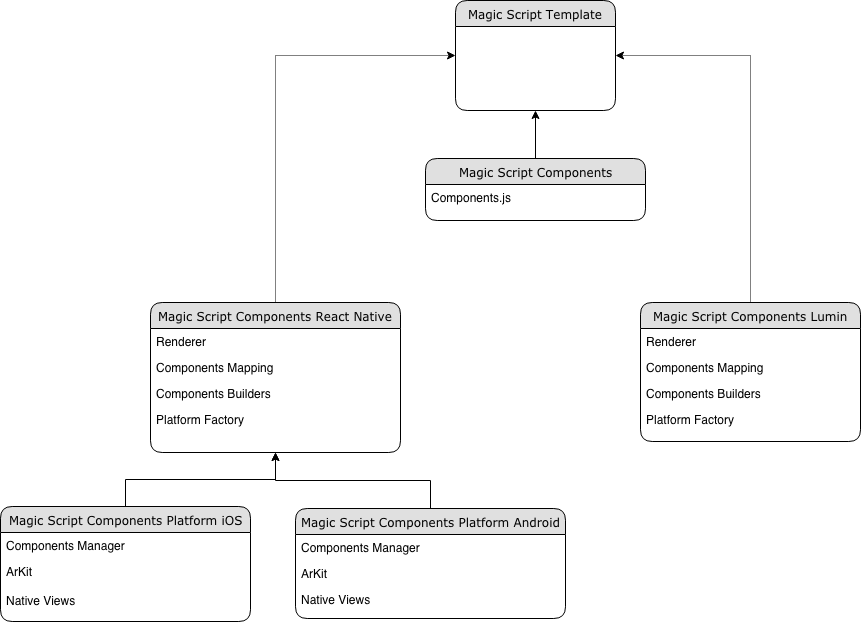

# MagicScript Command Line Toolkit

[](https://codecov.io/gh/magic-script/magic-script-cli)
[](https://github.com/magic-script/magic-script-cli/actions)
[](https://badge.fury.io/js/magic-script-cli)
[](https://www.npmjs.com/package/magic-script-cli)
[](LICENSE)

This repository is the command line toolkit for generating, compiling, and running MagicScript applications.

## Installation

Installation is easy assuming you have [Node.js](https://nodejs.org/) already installed.

```bash
npm install -g magic-script-cli
```

You can now access the toolkit as `magic-script` in your system path.

## Usage

See https://magicscript.org/ for more documentation.

## Developing for Multiplatform (MagicLeap, Android, iOS)

If you plan to develop for Android and/or iOS, follow instructions below:

### Tooling for iOS and Android

The detailed information on necessary tooling and setup for ReactNative you can find here: https://facebook.github.io/react-native/docs/getting-started
Verify your versions of tools with the minimum below:

**Common**:

| Tool   |      Version  |
|----------|:-------------:|
| NodeJS     |  >=12.10      |
| ReactNative CLI |    2.0.1   |
| NPM | should be installed with NodeJS |

**Android**:

To develop on Android platform, your device must support ARCore. To ensure your device supports ARCore visit: https://developers.google.com/ar/discover/supported-devices

| Tool   |      Version  |
|----------|:-------------:|
| Android SDK     |  >=28.0.3     |
| Gradle |    >=3.4.1  |
| Android Device OS | >=24 |
| JDK | >=8 |

**iOS**:
To develop on iOS platform, your device must support ARKit. To ensure your device supports ARKit visit and scroll to the bottom: https://www.apple.com/ios/augmented-reality/
Please be aware, that it is recommended to use the latest stable versions of below tools:

| Tool   |      Version  |
|----------|:-------------:|
| iOS device OS     |  >=12    |
| xCode | >=10  |
| CocoaPods | >=24 |

### First steps

**Creating a project**

1. Open terminal window, navigate to directory where you want to create the project and type `magic-script init`
2. Answer three questions about the Project Name, app ID (f.e. com.example.project) and Folder Name of the project
3. Using arrows choose what type of project do you want to create. For developing on multiple platforms choose `Components`
4. When you select `Components` type, you will be asked with 4th question. Using arrows and space bar, choose which platform you want to develop to
5. Done! Now you can navigate to the project and build the sample app on desired device!

**Building & running the project**

1. Navigate to the root directory of your project
2. Type `magic-script build android` or `magic-script build ios`. If you have device connected, the project will be built & installed on your device. That's it!
3. Type `magic-script build lumin` to build project for MagicLeap device. Type `magic-script build lumin -i` if you want to build & install the app on MagicLeap. That's it!

### Troubleshooting (for iOS and Android)

**Creating the project**
- If you have information that Android SDK environment variable doesn't exist, it means that local.properties file wasn't created under `<project>/reactnative/android`. 
a. If you have Android Studio installed, open `<project>/reactnative/android` as an Android project. The local.properties file should be created automatically
b. If not, create `local.properties` file in `<project>/reactnative/android` with one line: `sdk.dir=<Location of your Android SDK>`
- If you have information that CLI couldn't create symlink for resources directory and you want to use resources on Android or iOS (like images, video, sounds, 3D model), you have to create a directory symlink in `<project>/reactnative/` pointing to `<project>/resources`. 
a. If you're Windows user, you can find more information here: https://docs.microsoft.com/en-us/windows-server/administration/windows-commands/mklink
b. If you're MacOS or Linux user, you can use `ln` tool for that
- If you have information that the project couldn't be renamed to the specified by the user, the project will be called `Template` and package id will be set to `com.magicscript.template`. If you want to change the name of the project and package id:
a. For Android use Android Studio to change the project name and package id
b. For iOS use XCode to change the project name and package id

**Building and installing the project**
- If you have problem with building & running the project, please check with informations below:
a. Check if you're executing your command in the root directory of the project.
b. There are differences between MagicScript project types (more information in the section Architecture).

**Problems during runtime**
- When you're developing on multiple platforms at once, and you're often changing the deployment target (f.e. you're installing the app on MagicLeap device, next on iOS device, and after that on Android device) there can be a problem with caching intermediates from different targets. Run below commands to clean up the cache:

####**IMPORTANT: Be extra cautious in which directory you are currently - below scripts are using `rm` and `del` tools, which can lead to irreparable situations!! If you are not familiar with those tools, we recommend execute commands between `&` and `&&` one after another!**

####**Execute the scripts from root directory of your project!!**
* Navigate to `reactnative` directory from root directory of your project
  * General React Native cleanup:
    * Windows users: `del %appdata%\Temp\react-native-* & del node_modules/ & npm cache clean --force & npm install & npm start -- --reset-cache`
    * MacOS users: `watchman watch-del-all && rm -rf $TMPDIR/react-native-packager-cache-* && rm -rf $TMPDIR/metro-bundler-cache-* && rm -rf node_modules/ && npm cache clean && npm install && npm start -- --reset-cache`
  * For Android builds:
    * Windows users: `cd android && gradlew clean && cd ..`
    * MacOS users: `cd android & gradlew clean & cd ..`
  * For iOS builds:
    * Delete the DerivedData of the app
    * On Windows: `cd ios & del Pods & del Podfile.lock & del *.xcworkspace & cd ..`
    * On MacOS: `cd ios && rm -rf Pods && rm -rf Podfile.lock && rm -rf *.xcworkspace && cd ..`

### Architecture of multiplatform MagicScript Components

The architecture of the multiplatform MagicScript Components project template is based on the architecture of the MagicScript Components ecosystem itself. Look below on the diagram:



As you can see, there is a hard separation between Magic Script Components library, which is just an interface/definition of the Components, and platform specific libraries, which are engines that are in charge of compiling, building and rendering the app on desired platform. This short explanation leads us to the main idea behind the 'monorepo' type project structure. If you choose to develop on all three platforms (MagicLeap, iOS and Android), your newly created project will have structure like this:

- common
- lumin
- reactnative
- resources
- src
- package.json

**common** - This directory has the source files common for both lumin and reactnative library. They're needed to write one source code that will run on all three platforms
**lumin** - This directory has all of the configuration files needed to compile, build and deploy the app to the MagicLeap device
**reactnative** - This directory has all of the configuration files needed to compile, build and deploy the app to the iOS and Android device
**resources** - This directory should be used if you want to add assets to your project, like 3D model, image, video or audio.
**src** - This is where you should put your source code of the application
**package.json** - It contains only `magic-script-components` library, which is (like described above), a definition of the Components. If you want to add some other dependencies to your app, you should place it in this package.json

####How does it work under the hood?

Building iOS & Android project:

1. The Metro Bundler is configured to grab the code from the `src` directory, resolve dependencies and bundle all of the source code files into single file that will be understood by the machine.
2. The `reactnative` directory has its own package.json with the dependencies needed by the engine to render the app on the device. That's where the `magic-script-components-react-native` library is
3. After successful compilation the app is deployed to the device

Building MagicLeap project:

1. The MagicLeap device uses the Lumin Runtime platform for rendering. In the `lumin` directory you can see that the Rollup Bundler is used to bundle the source code. It is configured the same way as the Metro Bundler. It grabs the code from `src` directory, resolves dependencies and bundles the files.
2. The `lumin` directory (like mentioned above) has all of the configuration files and dependencies that are used to properly render the code on the device. This is where the `magic-script-components-lumin` library is set.
3. After successful compilation, the MagicScript CLI is executing few another steps to install and run the app on the MagicLeap device.

## License

This project is licensed under the Apache License, Version 2.0 - see the [LICENSE](LICENSE) file for details
